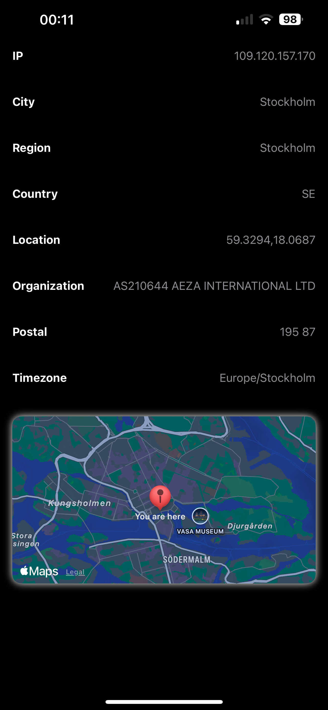
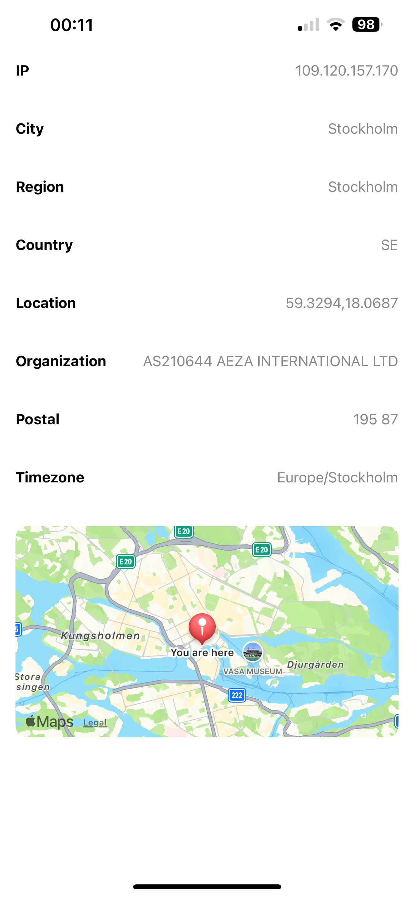

# iNetwork

An iOS app that fetches the geolocation of a given IP address and displays it on a map using Apple's MapKit.





## 📱 Features

- Fetches geolocation data from public IP using a REST API
- Displays location on the map using MapKit
- Built with Swift and UIKit
- Simple, clean UI
- Error handling for invalid IPs or network issues

## 🚀 Getting Started

### Prerequisites
- macOS with Xcode 14 or later
- iOS 15+ SDK

### Installation

```bash
git clone https://github.com/mohammadgdz/iNetwork.git
cd iNetwork
open iNetwork.xcodeproj
````

Then build and run the app on the simulator or a real device.


## 🧠 How It Works

1. User enters an IP address (or uses the default public IP)
2. The app calls a geolocation API (e.g. `ip-api.com`)
3. The response is parsed using Swift's `Codable`
4. Location is displayed on a `MapView`

## 📡 API Usage

The app uses [ip-api.com](http://ip-api.com/) for IP geolocation.

* Example endpoint: `http://ip-api.com/json/{ip}`

No API key required.

## ✅ Future Improvements

* Add unit tests and UI tests
* Save recent IP lookups
* Support dark mode and localization
* SwiftUI support (optional)

## 🤝 Contributing

Contributions are welcome!

1. Fork this repository
2. Create a feature branch (`git checkout -b feature-name`)
3. Commit your changes (`git commit -m 'Add new feature'`)
4. Push to the branch (`git push origin feature-name`)
5. Open a Pull Request

## 🧑‍💻 Author

Developed by [@mohammadgdz](https://github.com/mohammadgdz)
Feel free to reach out via GitHub or open an issue!

## 📄 License

This project is licensed under the MIT License. See the [LICENSE](LICENSE) file for details.

